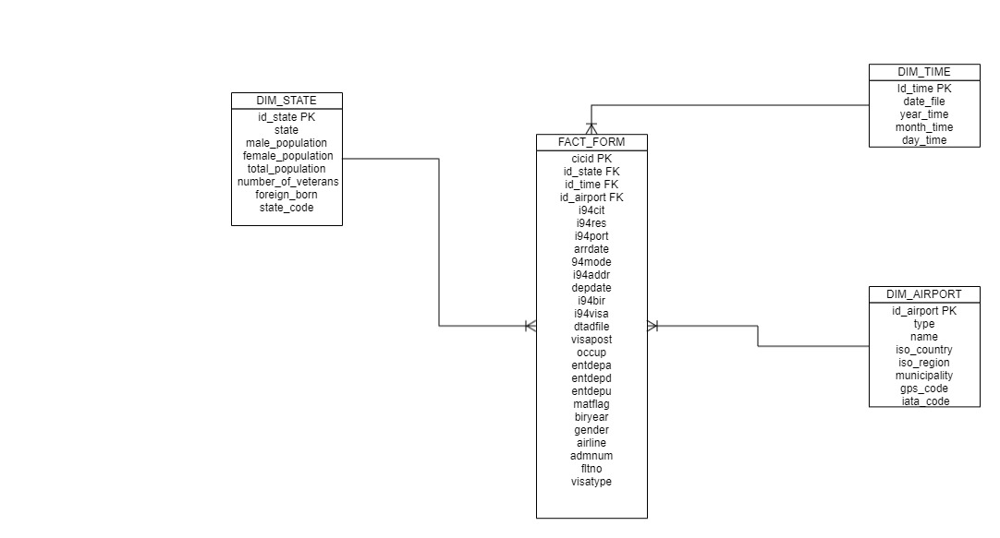

# Project Title
### Data Engineering Capstone Project
## Step 1: Scope the Project and Gather Data
#### Scope 
The main goal of this project is to demonstrate all abilities achieved in Udacity data engineering course. Three datasets has chosen for the project.

i94 Immigration Data : this dataset is from the US National Tourism and Trade Office. This data source is used to load fact table;

U.S. City Demographic Data: This dataset contains information about the demographics of all US cities and census-designated places with a population greater or equal to 65,000.This data comes from the US Census Bureau's 2015 American Community Survey;

Airport Codes: The airport codes may refer to either IATA airport code, a three-letter code which is used in passenger reservation, ticketing and baggage-handling systems, or the ICAO airport code which is a four letter code used by ATC systems and for airports that do not have an IATA airport code.

The project implements a data lake using the datasets above loading data in a Redshift database hosted in AWS (Amazon Web Services). Through Pyspark the data has been extracted from immigration data and analysed before loading into the Redshift database. The conceptual data model was based in star schema defining a factless table and three dimension tables. Information like total or visitors, tourism by nationality, ports of entry and number of flights by airport executing queries on the tables. The workspace is the environment, including Pandas, Pyspark and Ipython-sql libraries. Python and SQL are the main languages used on this project. Using Pandas it was possible to see the details in Immigration dataset that was in sas format originally. Getting the meaning and understanding the Immigration data, it was possible to implement the star schema model. Through Pyspark the Immigration dataset was converted to parquet files and uploaded to S3 bucket (AWS service) together with other datasets in csv format. Using Exercise 2: Creating Redshift Cluster using the AWS python SDK the Redshift cluster is launched. So executing ETL code the Redshift stage tables are created and data loaded from dataset files.   
* Step 2: Explore and Assess the Data
## Step 3: Define the Data Model
  

* Step 4: Run ETL to Model the Data
* Step 5: Complete Project Write Up
