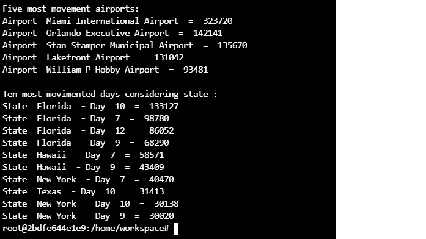

# Data Engineering Capstone Project

## Step 1: Scope the Project and Gather Data

### Project Summary

The objective of this project is to give some key information to US National Tourism and Trade Office. For achieve this, it was created an ETL pipeline from three dataset sources: I94 immigration, US demographics and Airport codes.So, we could give some key indicators like most movimented airports or most movimented days considering state. 

#### Scope 

Three datasets has chosen for the project:

i94 Immigration Data : this dataset is from the US National Tourism and Trade Office. This data source is used to load fact table;

U.S. City Demographic Data: This dataset contains information about the demographics of all US cities and census-designated places with a population greater or equal to 65,000.This data comes from the US Census Bureau's 2015 American Community Survey;

Airport Codes: The airport codes may refer to either IATA airport code, a three-letter code which is used in passenger reservation, ticketing and baggage-handling systems, or the ICAO airport code which is a four letter code used by ATC systems and for airports that do not have an IATA airport code.

The project implements a data lake using the datasets above loading data in a Redshift database hosted in AWS (Amazon Web Services). Through Pyspark the data has been extracted from immigration data and analysed before loading into the Redshift database. The conceptual data model was based in star schema defining a factless table and three dimension tables. Information like total or visitors, tourism by nationality, ports of entry and number of flights by airport executing queries on the tables. The workspace is the environment, including Pandas, Pyspark and Ipython-sql libraries. Python and SQL are the main languages used on this project. Using Pandas it was possible to see the details in Immigration dataset that was in sas format originally. Getting the meaning and understanding the Immigration data, it was possible to implement the star schema model. Through Pyspark the Immigration dataset was converted to parquet files and uploaded to S3 bucket (AWS service) together with other datasets in csv format. Using Exercise 2: Creating Redshift Cluster using the AWS python SDK the Redshift cluster is launched. So executing ETL code the Redshift stage tables are created and data loaded from dataset files. About the tools has chosen, S3 is very flexible to build a data lake repository allowing lot of possible type files. The Redshift is a column database very fast to aggregate data. Both, hosted on AWS work very well toguether. 

Once, the tables of star schema is loaded, some queries could be executed crossing data between fact and dimension tables. With simple query join using fact and dimension tables you could get total of tourists that arrived in airport or most visited states. An OLAP tool can be used to extract and aggregate infromation. The star schema model allows get information very fast using fewer JOINs between tables using simple queries. 

## Step 2: Explore and Assess the Data

<pre class="wp-block-preformatted">
cicid	i94yr	i94mon	i94cit	i94res	i94port	arrdate	i94mode	i94addr	depdate	...	entdepu	matflag	biryear	dtaddto	gender	insnum	airline	admnum	fltno	visatype
0	6.0	2016.0	4.0	692.0	692.0	XXX	20573.0	NaN	NaN	NaN	...	U	NaN	1979.0	10282016	NaN	NaN	NaN	1.897628e+09	NaN	B2
1	7.0	2016.0	4.0	254.0	276.0	ATL	20551.0	1.0	AL	NaN	...	Y	NaN	1991.0	D/S	M	NaN	NaN	3.736796e+09	00296	F1
2	15.0	2016.0	4.0	101.0	101.0	WAS	20545.0	1.0	MI	20691.0	...	NaN	M	1961.0	09302016	M	NaN	OS	6.666432e+08	93	B2
3	16.0	2016.0	4.0	101.0	101.0	NYC	20545.0	1.0	MA	20567.0	...	NaN	M	1988.0	09302016	NaN	NaN	AA	9.246846e+10	00199	B2
4	17.0	2016.0	4.0	101.0	101.0	NYC	20545.0	1.0	MA	20567.0	...	NaN	M	2012.0	09302016	NaN	NaN	AA	9.246846e+10	00199	B2
</pre>

## Step 3: Define the Data Model

Star schema it have been chosen because it has better performance to retrieve data. Using one fact table and the dimensions the query joins will be fast and easy to implement. You can generate key indicators and agregate information very easy way using SQL or Python. It is possible use a OLAP tool giving a much possibilities to end user. The star schema is very indicated to work with kind of tool. Follow below the ERD:

  
# Data Dictionary

FACT TABLE fact_form

PK "cicid" FLOAT - Primary key
FK "id_state" VARCHAR - Foreign key from dim_state
FK "id_time" BIGINT - Foreign key from dim_time
FK "id_airport" VARCHAR - Foreign key from dim_airport "i94cit" FLOAT - Country code "i94res" FLOAT - Country code "i94port" VARCHAR - Port code
"arrdate" FLOAT - Arrival Date in the USA
"i94mode" FLOAT - (1 = 'Air' 2 = 'Sea' 3 = 'Land' 9 = 'Not reported') "depdate" FLOAT - Departure Date from the USA
"i94bir" FLOAT - Age of Respondent in Years "i94visa" FLOAT - Visa codes collapsed into three categories (1 = Business 2 = Pleasure 3 = Student) "dtadfile" VARCHAR - Date added to I-94 Files
"visapost" VARCHAR - Department of State where where Visa was issued "occup" VARCHAR - Occupation that will be performed in U.S. "entdepa" VARCHAR - Arrival Flag - admitted or paroled into the U.S. "entdepd" VARCHAR - Departure Flag - Departed, lost I-94 or is deceased "entdepu" VARCHAR - Update Flag - Either apprehended, overstayed, adjusted to perm residence "matflag" VARCHAR - Match flag - Match of arrival and departure records
"biryear" FLOAT - 4 digit year of birth
"gender" VARCHAR - Non-immigrant sex
"airline" VARCHAR - Airline used to arrive in U.S.
"admnum" FLOAT - INS number "fltno" VARCHAR - Flight number of Airline used to arrive in U.S.
"visatype" VARCHAR - Class of admission legally admitting the non-immigrant to temporarily stay in U.S.

DIMENSION "dim_state"

PK id_state VARCHAR - Primary Key
"state" VARCHAR - State arrive in the USA
"male_population" FLOAT - State population "female_population" FLOAT - Female population
"total_population" FLOAT - Total population
"number_of_veterans" FLOAT - Total veterans
"foreign_born" FLOAT - Total foreigners

DIMENSION "dim_airport"

PK id_airport VARCHAR - Primary Key
"type" VARCHAR - Type of airport "name" VARCHAR - Name of airport "iso_country" VARCHAR - iso_country "iso_region" VARCHAR - iso_region "municipality" VARCHAR - Name of municipality "gps_code" VARCHAR - GPS coordinates "local_code" VARCHAR - local airport code "iata_code" VARCHAR - IATA airport code

DIMENSION "dim_time"

PK "Id_time" bigint IDENTITY(1,1) - Primary Key
"date_file" date - Date YYYYMMDD
"year_time" integer - Year of date
"month_time" integer - Month of date "day_time" integer - Day of date
  

## Step 4: Run ETL to Model the Data

Steps to run ETL Pipeline:

* Create a S3 bucket;
* Upload csv and parquet files to S3;
* Launch a Redshift cluster;
* Execute capstone.py;

The capstone.py executes the following steps:

* Create stage tables;
* Load data from files in S3 to stage tables;
* Load data from stage fact and dimension tables to fact table;
* Check data quality in fact and dimension tables;
* Run query samples;

### Results of queries cited in summary project

## Step 5: Complete Project Write Up

The data was increased by 100x: The partition could be required under files generated from SAS original files or convert cvs files in parquet partition files. The partition could be 83% faster than no partition files. It must analyze some column like date or state to partition data in parquet files. The load routine must consider the column partition to get the partition advantage. The partition creates a folder structure according to partition column values. So, load routine to copy files must create the right structure to load in Redshift database. 
(https://blog.datasyndrome.com/python-and-parquet-performance-e71da65269ce)
 
The data populates a dashboard that must be updated on a daily basis by 7am every day: Using airflow DAGs and setting default arguments you can schedule to run every day at 7am. The specific arguments execution_date and next_execution_date must be defined to DAGs start at 7am. It is important ETL pipeline starts on time otherwise it will not provide updated information to users. The cost of hiring airflow service in AWS starts at $0.49 (50 DAGs). The Airflow Workflow Jobs can be executed on Amazon EKS or Amazon ECS because they make it easier to manage and autoscale Airflow clusters. You can optimize it for cost using EC2 Spot Instances.
(https://airflow.apache.org/docs/apache-airflow/stable/concepts/index.html)

The database needed to be accessed by 100+ people: Redshift database can make 500 concurrent connections in a cluster but it is possible a maximum 15 queries can be run at the same time in a cluster. If replication is needed, we can use Amazon Kinesis. The Kinesis can replicate Redshift and ensure that multiple Redshift instances, in different availability zones/geographies, act as replicas and are in synchronized with each other always. Redshift has a feature called concurrency scaling. This feature improves resources to your Redshift cluster on an on-demand basis, adding processing power during peak time and withdrawing it in easy moments. There are three eligibility requirements for concurrency scaling. Your Redshift cluster must be: (EC2-VPC platform / Node type must be dc2.8xlarge, ds2.8xlarge, dc2.large, ds2.xlarge, ra3.4xlarge, or ra3.16xlarge.
Number of nodes between 2 and 32). Adopting concurrency scaling the solution will be most robust keeping high disponibility. But single-node clusters are not eligible, having cost per hour higher.
(https://aws.amazon.com/kinesis/)
